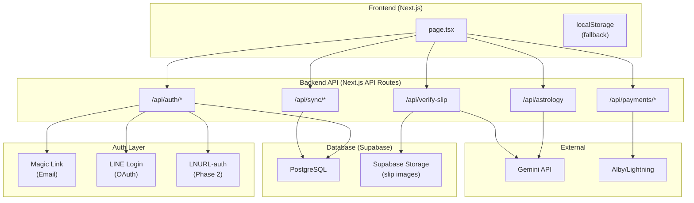
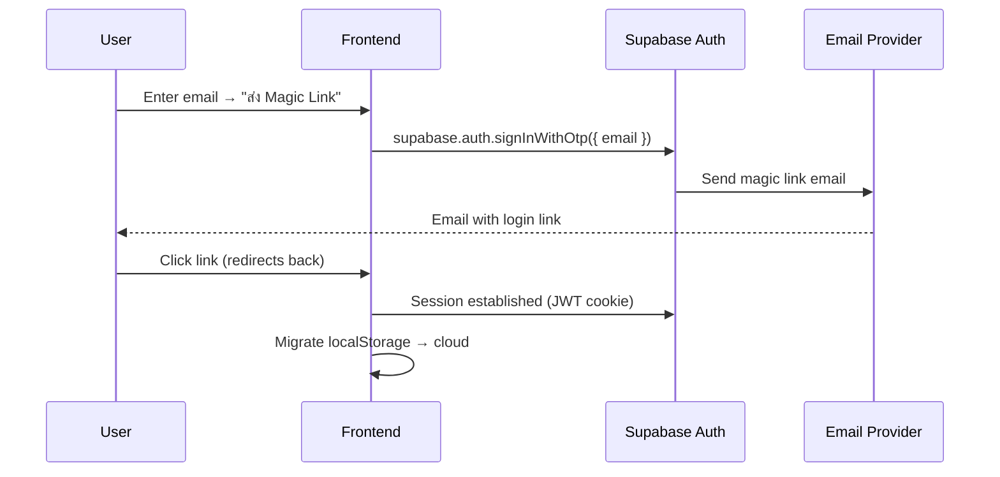
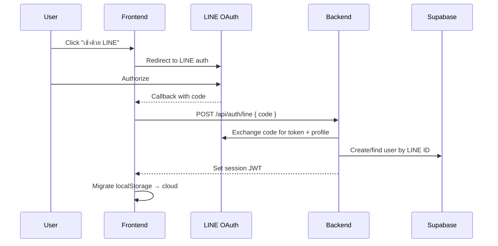

# Pekky: Backend Design Manual v2.0
## สำหรับ Backend Dev Agent

> **Goal:** ออกแบบระบบ Backend ที่รองรับ User Accounts, Cross-device sync, และ Payment verification สำหรับแอป Pekky โดยยึดหลัก: **No passwords, Minimal PII, Serverless-first**

---

## 1. Architecture Overview



---

## 2. Tech Stack Decision

| Component | Choice | Rationale |
|-----------|--------|-----------|
| **Database** | Supabase (Postgres) | Free tier generous, built-in auth, RLS |
| **Auth** | Supabase Auth + custom providers | Magic Link built-in, LINE via custom OAuth |
| **Storage** | Supabase Storage | For slip images (auto-delete after 30 days) |
| **Hosting** | Vercel (existing) | Next.js native, edge functions |
| **Session** | JWT (httpOnly cookie) | Stateless, secure, no session DB needed |

---

## 3. Database Schema

### 3.1 `users` (Managed by Supabase Auth)

Supabase Auth handles this automatically. We extend with a `profiles` table.

### 3.2 `user_profiles` (Birth Profiles — max 5 per user)

```sql
CREATE TABLE user_profiles (
  id UUID PRIMARY KEY DEFAULT gen_random_uuid(),
  user_id UUID NOT NULL REFERENCES auth.users(id) ON DELETE CASCADE,
  display_name TEXT NOT NULL,          -- "พีร์" (display only, no real name required)
  birth_date_enc BYTEA NOT NULL,       -- AES-encrypted birth date
  birth_time_enc BYTEA NOT NULL,       -- AES-encrypted birth time
  lat DOUBLE PRECISION NOT NULL,
  lon DOUBLE PRECISION NOT NULL,
  location_name TEXT,                  -- "Bangkok, Thailand"
  is_default BOOLEAN DEFAULT FALSE,
  created_at TIMESTAMPTZ DEFAULT NOW(),
  updated_at TIMESTAMPTZ DEFAULT NOW(),
  
  CONSTRAINT max_profiles CHECK (
    (SELECT COUNT(*) FROM user_profiles up WHERE up.user_id = user_id) <= 5
  )
);

-- RLS: Users can only access their own profiles
ALTER TABLE user_profiles ENABLE ROW LEVEL SECURITY;
CREATE POLICY "users_own_profiles" ON user_profiles
  USING (auth.uid() = user_id);
```

> [!IMPORTANT]
> **Birth data is PII.** วันเกิด+เวลาเกิดเป็นข้อมูลส่วนบุคคลระดับสูง ต้อง encrypt at rest ด้วย AES-256 โดยใช้ key จาก environment variable (`ENCRYPTION_KEY`)

### 3.3 `readings` (Saved Readings — max 50 per user)

```sql
CREATE TABLE readings (
  id UUID PRIMARY KEY DEFAULT gen_random_uuid(),
  user_id UUID NOT NULL REFERENCES auth.users(id) ON DELETE CASCADE,
  profile_id UUID REFERENCES user_profiles(id) ON DELETE SET NULL,
  mode TEXT NOT NULL,                  -- 'daily', 'detailed', 'blueprint', etc.
  persona TEXT NOT NULL DEFAULT 'expert',
  reading_text TEXT NOT NULL,          -- The AI-generated reading
  astro_data JSONB,                    -- Compact astro summary (planets, mahadasha)
  follow_up_count INT DEFAULT 0,      -- Number of follow-ups used
  amount_sats INT DEFAULT 0,          -- Amount paid (0 = free)
  amount_thb DECIMAL(10,2) DEFAULT 0,
  payment_method TEXT,                 -- 'lightning', 'promptpay', null (free)
  created_at TIMESTAMPTZ DEFAULT NOW(),
  
  CONSTRAINT max_readings CHECK (
    (SELECT COUNT(*) FROM readings r WHERE r.user_id = user_id) <= 50
  )
);

ALTER TABLE readings ENABLE ROW LEVEL SECURITY;
CREATE POLICY "users_own_readings" ON readings
  USING (auth.uid() = user_id);
```

### 3.4 `payments` (Payment Ledger)

```sql
CREATE TABLE payments (
  id UUID PRIMARY KEY DEFAULT gen_random_uuid(),
  user_id UUID REFERENCES auth.users(id),  -- nullable for guest payments
  reading_id UUID REFERENCES readings(id),
  method TEXT NOT NULL,                -- 'lightning' | 'promptpay'
  amount_sats INT NOT NULL,
  amount_thb DECIMAL(10,2),
  status TEXT NOT NULL DEFAULT 'pending', -- 'pending' | 'confirmed' | 'failed'
  
  -- Lightning specific
  payment_hash TEXT,
  
  -- PromptPay specific
  pp_ref_id TEXT,                      -- Extracted from slip by AI
  slip_verified_at TIMESTAMPTZ,
  
  created_at TIMESTAMPTZ DEFAULT NOW(),
  confirmed_at TIMESTAMPTZ
);

-- Index for duplicate detection
CREATE UNIQUE INDEX idx_pp_ref_id ON payments(pp_ref_id) WHERE pp_ref_id IS NOT NULL;
CREATE UNIQUE INDEX idx_payment_hash ON payments(payment_hash) WHERE payment_hash IS NOT NULL;
```

---

## 4. Auth System Design

### 4.1 Principles

| Principle | Implementation |
|-----------|---------------|
| **No passwords** | Magic Link + OAuth only |
| **Minimal PII** | Only email OR LINE ID stored |
| **Lazy registration** | Account created after first reading, not before |
| **Guest-first** | Full functionality without account; account = sync bonus |

### 4.2 Auth Flows

#### Magic Link (Email)



#### LINE Login (Thai users)



### 4.3 Data Migration (localStorage → Cloud)

เมื่อ user สร้างบัญชีครั้งแรก:

```typescript
async function migrateLocalToCloud(userId: string) {
  // 1. Migrate profiles
  const localProfiles = JSON.parse(localStorage.getItem('nox_profiles') || '[]');
  for (const p of localProfiles) {
    await supabase.from('user_profiles').insert({
      user_id: userId,
      display_name: p.name,
      birth_date_enc: encrypt(p.birthDateStr),
      birth_time_enc: encrypt(p.birthTimeStr),
      lat: p.lat, lon: p.lon,
      location_name: p.locationName
    });
  }
  
  // 2. Migrate reading history
  const localHistory = JSON.parse(localStorage.getItem('pekky_reading_history') || '[]');
  for (const r of localHistory) {
    await supabase.from('readings').insert({
      user_id: userId,
      mode: r.mode, persona: r.persona,
      reading_text: r.reading,
      astro_data: r.astrology,
      created_at: r.date
    });
  }
  
  // 3. Mark migration complete
  localStorage.setItem('pekky_migrated', 'true');
}
```

---

## 5. API Routes Spec

### 5.1 Auth Routes

| Route | Method | Description |
|-------|--------|-------------|
| `/api/auth/magic-link` | POST | Send magic link email |
| `/api/auth/line` | POST | Exchange LINE code for session |
| `/api/auth/session` | GET | Get current session status |
| `/api/auth/logout` | POST | Clear session |

### 5.2 Sync Routes

| Route | Method | Description |
|-------|--------|-------------|
| `/api/sync/profiles` | GET | Fetch all user profiles |
| `/api/sync/profiles` | POST | Create/update a profile |
| `/api/sync/profiles/:id` | DELETE | Delete a profile |
| `/api/sync/readings` | GET | Fetch reading history (paginated) |
| `/api/sync/readings/:id` | GET | Fetch single reading |

### 5.3 Payment Routes (Updated)

| Route | Method | Description |
|-------|--------|-------------|
| `/api/payments/invoice` | POST | Generate Lightning invoice |
| `/api/payments/verify-ln` | GET | Poll Lightning payment status |
| `/api/payments/history` | GET | User's payment history |

**Phase 2 (PromptPay gateway):**

| Route | Method | Description |
|-------|--------|-------------|
| `/api/payments/promptpay` | POST | Create PromptPay charge via gateway |
| `/api/payments/webhook` | POST | Receive payment confirmation from gateway |

---

## 6. Security Model

### 6.1 What We Store

| Data | Stored? | How |
|------|---------|-----|
| Email/LINE ID | ✅ | Supabase Auth (hashed by default) |
| Password | ❌ | **Never** — passwordless only |
| Birth date/time | ✅ | AES-256 encrypted at rest |
| Lat/Lon | ✅ | Plaintext (not PII by itself) |
| Reading text | ✅ | Plaintext (it's the user's data) |
| Slip images | ⏰ | Auto-deleted after 30 days |
| Payment hashes | ✅ | For duplicate detection only |

### 6.2 What We Never Store

- ❌ Passwords or password hashes
- ❌ Full name (only display name chosen by user)
- ❌ National ID / Citizen ID
- ❌ Bank account numbers
- ❌ Credit card numbers

### 6.3 Encryption

```typescript
// lib/crypto.ts
import { createCipheriv, createDecipheriv, randomBytes } from 'crypto';

const ALGORITHM = 'aes-256-gcm';
const KEY = Buffer.from(process.env.ENCRYPTION_KEY!, 'hex'); // 32 bytes

export function encrypt(text: string): string {
  const iv = randomBytes(16);
  const cipher = createCipheriv(ALGORITHM, KEY, iv);
  let encrypted = cipher.update(text, 'utf8', 'hex');
  encrypted += cipher.final('hex');
  const tag = cipher.getAuthTag().toString('hex');
  return `${iv.toString('hex')}:${tag}:${encrypted}`;
}

export function decrypt(data: string): string {
  const [ivHex, tagHex, encrypted] = data.split(':');
  const decipher = createDecipheriv(ALGORITHM, KEY, Buffer.from(ivHex, 'hex'));
  decipher.setAuthTag(Buffer.from(tagHex, 'hex'));
  let decrypted = decipher.update(encrypted, 'hex', 'utf8');
  decrypted += decipher.final('utf8');
  return decrypted;
}
```

---

## 7. Implementation Priority

### Phase 6A: Core Auth (1-2 days)
- [ ] Set up Supabase project + schema
- [ ] Implement Magic Link auth
- [ ] Add session management (JWT cookies)
- [ ] Create auth UI components (login modal)

### Phase 6B: Cloud Sync (1-2 days)
- [ ] Sync profiles (CRUD)
- [ ] Sync reading history
- [ ] localStorage → cloud migration
- [ ] Dual-mode: works with or without account

### Phase 6C: LINE Login (1 day)
- [ ] Register LINE Login Channel
- [ ] Implement OAuth flow
- [ ] Link LINE users to Supabase accounts

### Phase 6D: Payment Ledger (1 day)
- [ ] Create payments table
- [ ] Record all payments (Lightning + PromptPay)
- [ ] Duplicate ref_id detection for PromptPay
- [ ] Connect payments to readings

---

## 8. Environment Variables Required

```env
# Supabase
NEXT_PUBLIC_SUPABASE_URL=https://xxx.supabase.co
NEXT_PUBLIC_SUPABASE_ANON_KEY=eyJ...
SUPABASE_SERVICE_ROLE_KEY=eyJ...

# Encryption
ENCRYPTION_KEY=<64-char hex string>

# LINE Login
LINE_CHANNEL_ID=<from LINE Developers Console>
LINE_CHANNEL_SECRET=<from LINE Developers Console>

# Existing
GOOGLE_GENERATIVE_AI_API_KEY=<existing>
ALBY_ACCESS_TOKEN=<existing>
```

---

## 9. Frontend Integration Guide

### 9.1 Auth State Management

```typescript
// lib/auth.ts — hook for auth state
export function useAuth() {
  const [user, setUser] = useState<User | null>(null);
  const [isGuest, setIsGuest] = useState(true);
  
  useEffect(() => {
    // Check Supabase session
    const { data: { session } } = await supabase.auth.getSession();
    if (session) {
      setUser(session.user);
      setIsGuest(false);
    }
    
    // Listen for auth changes
    supabase.auth.onAuthStateChange((event, session) => {
      setUser(session?.user ?? null);
      setIsGuest(!session);
      
      if (event === 'SIGNED_IN' && !localStorage.getItem('pekky_migrated')) {
        migrateLocalToCloud(session!.user.id);
      }
    });
  }, []);
  
  return { user, isGuest };
}
```

### 9.2 Profile Loading (Cloud-first, localStorage fallback)

```typescript
async function loadProfiles(): Promise<UserProfile[]> {
  if (user) {
    // Logged in → load from cloud
    const { data } = await supabase
      .from('user_profiles')
      .select('*')
      .order('created_at');
    return data?.map(decryptProfile) || [];
  } else {
    // Guest → load from localStorage
    return JSON.parse(localStorage.getItem('nox_profiles') || '[]');
  }
}
```
