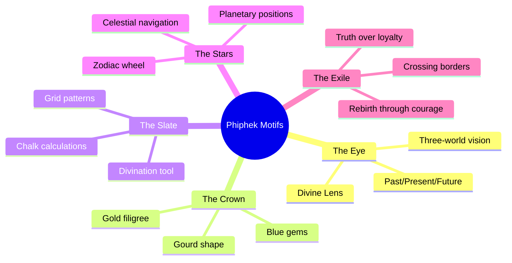

# Phiphek (พิเภก) — Corporate Identity Manual
## Design System for Astrodian, derived from the Lore of the Divine Oracle

---

## 1. The Lore — Source Material

### Who is Phiphek?

พิเภก (Phiphek) is the Thai adaptation of **Vibhishana** from the Ramayana. In the Ramakien, he is far more than a righteous defector — he is the **supreme astrologer** of the epic, a seer whose divination powers shaped the outcome of the entire war.

| Attribute | Detail |
|-----------|--------|
| **Full name** | พิเภก / ท้าวทศคิริวงศ์ (after coronation) |
| **Origin** | Son of ท้าวลัสเตียน (Latsatian) and นางรัชฎา (Rachada) |
| **True identity** | เวสสุญาณเทพบุตร — a celestial being sent by **Shiva** to infiltrate Lanka |
| **Family** | Younger brother of ทศกัณฐ์ (Thotsakan/Ravana) and กุมภกรรณ (Kumbhakarna) |
| **Wife** | นางตรีชฎา (Trichada) |
| **Daughter** | นางเบญกาย (Benjakai) |
| **Role** | Chief Astrologer and Strategic Advisor to Phra Ram's army |
| **Fate** | Crowned King of Lanka (กรุงลงกา) after the war |
| **Immortality** | One of the 8 Chiranjivis (immortal beings) |

### The Defining Moments

1. **The Dream Prophecy** — Thotsakan had a terrible dream. Phiphek interpreted it truthfully: Lanka will fall unless Sita is returned. For this act of honesty, he was **exiled**.
2. **The Defection** — Rather than compromise truth, Phiphek crossed enemy lines to join Phra Ram, offering his knowledge as a weapon.
3. **The War Advisor** — Phiphek became the lynchpin of every battle strategy, revealing demon secrets, neutralizing enchantments, and predicting enemy moves before they happened.
4. **The Coronation** — After the war, Phra Ram crowned Phiphek as the rightful king of Lanka — the astrologer who served truth, not power.

---

## 2. Visual Identity — Extracted from the Lore

### 2.1 Color Philosophy — "The Seer in the Dark"

Phiphek's body is green — but his power is **nocturnal**. He sees in the dark what others cannot. The dominant visual identity is therefore **Midnight Indigo + Divine Gold**, with Phiphek Emerald used sparingly as a signature accent — like the flash of a green eye in the darkness.

> [!IMPORTANT]
> **No black.** Black (ดำ) is culturally inauspicious in Thai tradition — associated with mourning, not divination. Use **Midnight Indigo** instead: a deep, warm navy that evokes the celestial night sky where the stars live. It's dark enough for contrast but carries warmth and มงคล (auspiciousness).
>
> **Green is a spice, not the main course.** Use it the way a master painter uses vermillion — strategically, at moments of importance. The app should feel like **gold on deep indigo** with emerald appearing only when something meaningful happens.

#### Primary Color Palette

| Swatch | Name | Hex | Role | Usage |
|--------|------|-----|------|-------|
| 🟣 | **Midnight Indigo** | `#121A2E` | **Dominant** | Primary background, canvas |
| 🟤 | **Slate Surface** | `#1C2640` | **Dominant** | Cards, panels, elevated surfaces |
| 🟡 | **Divine Gold** | `#D4A843` | **Dominant** | Headers, borders, accents, crowns |
| ⬜ | **Parchment Cream** | `#F5F0E6` | **Dominant** | Primary text, light mode bg |
| 🟩 | **Phiphek Emerald** | `#18A558` | **Signature** | Links, success states, hover accents |
| 🟢 | **Oracle Green** | `#0D7A3F` | **Signature** | Dark-on-light variant, rare emphasis |
| 🔵 | **Celestial Sapphire** | `#2E5FA1` | **Secondary** | The right eye, divine vision, info |

#### The 80/15/5 Rule

```
80% — Midnight Indigo + Parchment (the stage)
15% — Divine Gold (the frame)
 5% — Phiphek Emerald (the signature)
```

### 2.2 The Crown — มงกุฎน้ำเต้ากลม (Gourd Crown)

Phiphek wears a distinctive **round gourd-shaped crown** (มงกุฎน้ำเต้ากลม), unlike the towering tiered crowns of kings or the spired crowns of other demons. This crown is:
- **Rounded and organic** — suggesting wisdom over authority
- **Adorned with blue glass/gems** — celestial knowledge
- **Gold** — divine appointment by Shiva

#### Design Principle: *Round > Angular*
Use rounded shapes, soft corners, and organic forms throughout the UI. Avoid sharp, aggressive geometries associated with warrior demons.

```
Crown Silhouette → Logo shape, avatar frames, card corners
Gourd shape → Loading indicators, notification badges
Blue gem accent → Information icons, "insight" features
```

### 2.3 The Face — ปากแสยะ ตาจระเข้ (Bared Teeth, Crocodile Eyes)

The Khon mask has:
- **ปากแสยะ** — Bared teeth, a fierce grin. Not malicious, but **unflinchingly honest**. He tells you the truth whether you want to hear it or not.
- **ตาจระเข้** — Crocodile eyes. Patient, watchful, seeing everything beneath the surface.

#### Design Principle: *Bold Honesty*
The voice of the app should be confident and direct. No mealy-mouthed disclaimers or vague platitudes. Phiphek tells you what the stars say, clearly and boldly.

### 2.4 The Right Eye — แว่นวิเศษ (The Divine Lens)

Shiva gifted Phiphek a **divine lens on his right eye** that grants:
- **Past** — karma, origins, root causes
- **Present** — current planetary positions, active transits
- **Future** — predictions, timelines, destiny blueprints

> [!TIP]
> This is the single most powerful design motif. The "Divine Eye" or "Third Eye" represents the app's core value proposition: **seeing what others cannot see**.

#### Design Applications
| Element | Motif |
|---------|-------|
| App logo / favicon | Stylized eye with celestial elements |
| Loading state | Eye opening animation |
| Chart center piece | Eye / lens motif |
| Premium tier badge | Golden eye icon |
| "Insight" sections | Eye icon + emerald glow |

### 2.5 The Weapon — กระดานชนวน (Divination Slate)

While other demons carry clubs, swords, and bows, Phiphek's "weapon" is a **divination slate** (กระดานชนวน) — a tablet used for astrological calculations and prophecy.

#### Design Principle: *Knowledge as Power*
The app elevates data and analysis as the primary interface, not flashy animations or gamification. Charts, tables, and calculation outputs are treated as first-class citizens.

```
Divination Slate → Card/panel design language
Chalk markings → Subtle grid patterns, chart annotations
Slate texture → Dark mode surface treatment
```

---

## 3. Typography Principles

### Derived from the Lore

| Quality | Lore Source | Typographic Expression |
|---------|-------------|----------------------|
| **Wisdom** | Supreme astrologer | Serif or mixed serif for headings (authority) |
| **Clarity** | Truth-teller, even when painful | High-contrast, excellent readability |
| **Youth** (Pekky) | The apprentice child prodigy | Rounded, friendly body text |
| **Mysticism** | Divine origins, three-world vision | Decorative elements for special headings |

### Recommended Stack

```css
/* Headings: Authority + Thai elegance */
--font-heading: 'Noto Serif Thai', 'Playfair Display', serif;

/* Body: Clarity + warmth */
--font-body: 'Noto Sans Thai', 'Inter', sans-serif;

/* Data/Code: Precision */
--font-mono: 'JetBrains Mono', 'Fira Code', monospace;

/* Special: Mystical accents (sparingly) */
--font-accent: 'Cinzel Decorative', serif;
```

---

## 4. Iconography & Motifs

### Core Motifs (extracted from the lore)



### Pattern Language

| Pattern | Source | CSS/Design Expression |
|---------|--------|----------------------|
| **Crannog lattice** | Thai temple filigree | `border-image`, decorative dividers |
| **Zodiac ring** | Astrological wheel | Pre-rendered rotating ring asset |
| **Starfield** | Three-world celestial view | Subtle particle background |
| **Slate grain** | Divination tablet texture | Dark mode surface noise |
| **Gold threadwork** | Royal regalia, crown | Border accents, premium tier badges |

---

## 5. Tone of Voice

### The Phiphek Spectrum

The brand voice sits at the intersection of:

```
    MYSTICAL ←————————→ PRACTICAL
         |                    |
    AUTHORITATIVE ←——→ FRIENDLY
         |                    |
    (Phiphek)          (Pekky)
```

| Speaker | Voice | When |
|---------|-------|------|
| **Phiphek** (ท่านพิเภก) | Authoritative, regal, ancient wisdom. Short declarative sentences. | System messages, error states, brand copy |
| **Pekky** (เภกกี้) | Warm, confident, playful child prodigy. Uses "คุณ" (khun). | AI readings, conversational UI, onboarding |

### Voice Examples

| ❌ Generic | ✅ Phiphek Voice |
|-----------|-----------------|
| "Your reading is ready" | "ดวงดาวได้เปิดเผยแล้ว" (The stars have spoken) |
| "Error occurred" | "หมอกปกคลุมดวงชะตา — กรุณาลองใหม่" (Fog obscures the fate) |
| "Premium feature" | "วิสัยทัศน์แห่งตาทิพย์" (Vision of the Divine Eye) |
| "Loading..." | "กำลังเปิดตาทิพย์..." (Opening the Divine Eye...) |

---

## 6. Color Application Rules

### Dark Mode (ดั่งราตรีแห่งลงกา)
The default mode. Gold on deep indigo — emerald only at key interaction points.

```css
--bg-primary: #121A2E;        /* Midnight Indigo */
--bg-secondary: #182036;       /* Deep celestial */
--bg-card: #1C2640;            /* Slate surface */
--text-primary: #F5F0E6;       /* Parchment Cream */
--text-secondary: #9CA3AF;     /* Muted wisdom */
--accent-primary: #D4A843;     /* Divine Gold — the dominant accent */
--accent-green: #18A558;       /* Phiphek Emerald — signature only */
--accent-sapphire: #2E5FA1;    /* Celestial eye */
--border: rgba(212, 168, 67, 0.15); /* Faint gold thread */
--link-color: #18A558;         /* Emerald for links — the signature */
--success: #18A558;            /* Emerald for success states */
--hover-glow: rgba(24, 165, 88, 0.1); /* Faint emerald on hover */
```

### Light Mode (ดั่งรุ่งสางแห่งลงกา)
The dawn after Lanka's liberation. Warm parchment with aged gold; emerald for interactive elements.

```css
--bg-primary: #F5F0E6;        /* Parchment Cream */
--bg-secondary: #EDE8DA;       /* Warm parchment */
--bg-card: #FFFFFF;            /* Clean slate */
--text-primary: #121A2E;       /* Midnight Indigo */
--text-secondary: #4B5563;     /* Subdued */
--accent-primary: #B8922F;     /* Aged Gold — dominant accent */
--accent-green: #0D7A3F;       /* Oracle Green — signature only */
--accent-sapphire: #1E4A8A;    /* Deep sapphire */
--border: rgba(184, 146, 47, 0.2); /* Faint gold thread */
--link-color: #0D7A3F;         /* Oracle Green for links */
--success: #0D7A3F;
```

### Where Emerald Appears (and ONLY there)

| ✅ Use Emerald | ❌ NOT Emerald |
|---|---|
| Links / clickable text | Page backgrounds |
| Success indicators | Card backgrounds |
| Hover glow (subtle) | Headers or titles |
| Active toggle/tab state | Body text |
| Chart Ascendant marker | Navigation bars |
| "Verified" badges | Borders (use gold) |

---

## 7. Tier System — Mapped to the Lore

| Tier | Lore Reference | Price | Color Accent |
|------|---------------|-------|-------------|
| **Free (Chart Only)** | กระดานชนวน — The bare slate | ฿0 | Base emerald |
| **Free (Daily)** | คำพยากรณ์ประจำวัน — Quick glimpse through the eye | ฿0 | Base emerald |
| **Detailed** | ตาทิพย์เปิดครึ่งเดียว — Half-open divine eye | ฿10.80 | Emerald + Gold |
| **Focus Readings** | มองเจาะ — Focused divine gaze | ฿36 | Sapphire + Gold |
| **Blueprint** | ตาทิพย์เปิดเต็ม — Full divine vision, three worlds | ฿108 | Full Gold + Emerald glow |
| **Bitcoin Synastry** | เทพนคร × ลงกา — Realm collision reading | ฿54 | Sapphire + Orange (₿) |

---

## 8. Key Design Dos and Don'ts

### ✅ Do

- Use **Midnight Indigo + Divine Gold** as the dominant pair — the seer in the dark with golden truth
- Use **emerald sparingly** — signature accent for links, success, and hover; it's the flash of Phiphek's eye
- Use **round/organic shapes** — Phiphek's gourd crown, not angular demon spires
- Use the **eye motif** for insight, vision, and discovery moments
- Maintain a **dark-first** design — the seer who works in the dark
- Be **boldly honest** in copy — Phiphek was exiled for telling the truth

### ❌ Don't

- Don't **overuse green** — no green backgrounds, green headers, or green-on-green. It's a spice.
- Don't use **red** as a primary — it belongs to Thotsakan (the antagonist)
- Don't use **aggressive/spiky** design elements — Phiphek is wisdom, not force
- Don't use **cutesy/kawaii** aesthetics for the brand (save that only for Pekky's personality)
- Don't hide information behind excessive visual flair — the Divination Slate is functional first
- Don't use **generic horoscope/mysticism clichés** (crystal balls, tarot cards) — this is Jyotish astrology channeled through Thai classical tradition

---

## 9. The Pekky Sub-Brand

Pekky (เภกกี้) is Phiphek's digital apprentice — the child-prodigy AI voice. He inherits:

| From Phiphek | Pekky's Version |
|-------------|----------------|
| Green skin | Green-tinted avatar/logo |
| Divine Eye | Curious, bright eyes |
| Divination Slate | Digital tablet / chat interface |
| Royal authority | Confident child energy |
| Exile story | "New kid" energy, proving himself |

Pekky should feel like a **young monk** (เณร) who happens to be a tech prodigy — respectful, knowledgeable, but with a spark of mischief and warmth.

---

## 10. Summary — The Design DNA

```
Phiphek = Truth × Vision × Transformation

• Palette:  Midnight Indigo (stage) + Divine Gold (frame) + Emerald (signature)
• Ratio:    80% dark/neutral · 15% gold · 5% emerald
• Shape:    Rounded, organic, gourd-crown inspired
• Texture:  Slate grain + gold threadwork + starfield
• Voice:    Bold truth, warm wisdom
• Icon:     The Divine Eye — seeing past, present, future
• Theme:    "The Oracle Who Chose Truth Over Power"
```
