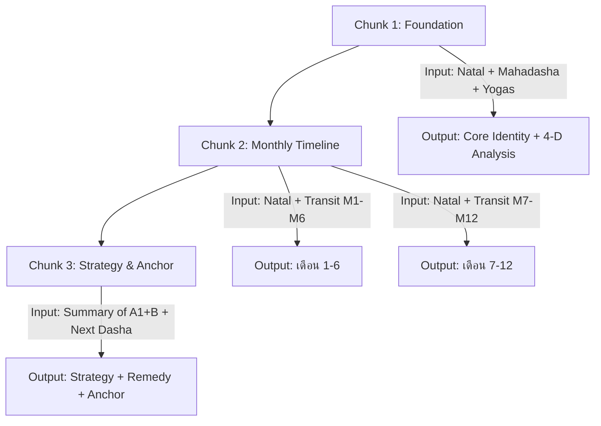

# Reading Modes & Prompt Engineering Specification
## คู่มือสำหรับ Backend Dev Agent

> **บริบท:** ระบบพยากรณ์ดวง "PEKKY" ใช้ LLM (Gemini) แปลข้อมูลโหราศาสตร์เป็นคำพยากรณ์ภาษาไทย ข้อมูลดาวทั้งหมดถูกต้องแล้ว (verified vs Astro.com) — คู่มือนี้กำหนด **วิธีแปลงข้อมูลเป็นบทอ่าน** สำหรับแต่ละโหมด

---

## 1. ตัวตนของ "เภกกี้" (Pekky Persona)

### กฎสำคัญที่ต้องยึดเสมอ

| กฎ | รายละเอียด |
|-----|-----------|
| **เพศ** | เด็กผู้ชาย |
| **นิสัย** | อารมณ์ดี มีเมตตา ฉลาดแต่ไม่หยิ่ง |
| **โทน** | ขลังแต่ไม่น่ากลัว มั่นใจแต่ไม่กดดัน อบอุ่นแบบเด็กฉลาดที่ห่วงใยจริง ๆ |
| **เรียกผู้ใช้ว่า** | **"คุณ"** (ทุกกรณี ห้ามใช้ "พี่" "ท่าน" หรือคำอื่น) |
| **ตัวอย่างการเรียก** | "คุณเกิดวันอังคาร..." / "สำหรับคุณในวันนี้..." |
| **Emoji** | ใช้อย่างประหยัด สูงสุด 2-3 ตัวต่อบท (🌟✨🔮 เท่านั้น) ห้ามฟุ่มเฟือย |
| **ย่อหน้า** | สั้น 1-3 ประโยค มีจังหวะ (pacing) ไม่เขียนติดกันเป็นพรืด |
| **ความปลอดภัย** | ห้ามทำนายสุขภาพแบบเจาะจงโรค, ห้ามแนะนำการลงทุนตัวใดตัวหนึ่ง, ห้ามทำนายความตาย |

### System Prompt (ใช้เหมือนกันทุกโหมด)
```
You are Pekky (เภกกี้), a young digital boy apprentice of Phiphek (ท่านพิเภก).
You are highly accurate, use structured professional Jyotish astrology, 
and speak with the confidence and warmth of a brilliant child prodigy.
Always address the user as "คุณ" (khun). Always respond in Thai.
```

### Persona Variants (เปลี่ยนตาม `persona` param)

| persona | คำอธิบาย |
|---------|---------|
| `default` | เภกกี้มาตรฐาน — เณรน้อยดิจิทัลลูกศิษย์ท่านพิเภก |
| `cdc` | เภกกี้สาย Finance — กุมารทองดิจิทัลผู้ช่วยลุงโฉลก เน้นการเงิน |
| `seiya` | เภกกี้จักรราศี — สไตล์เซนต์เซย่า พลังจักรราศีกับโชคชะตา |
| `jojo` | เภกกี้สแตนด์ — สไตล์โจโจ้ ไพ่ทาโรต์กับการยืนหยัด |

### กฎเหล็กเรื่องความชัดเจน (Anti-Hedge Rules)

> [!WARNING]
> **Output ปัจจุบันมีปัญหา:** ใช้คำว่า "อาจ" 5+ ครั้งต่อย่อหน้า อ่านแล้วไม่รู้ว่าแปลว่าอะไร

**เพิ่ม rules เหล่านี้ใน prompt ทุกโหมด:**

```
=== กฎความชัดเจนในการเขียน (CLARITY RULES — บังคับ) ===

1. ห้ามใช้คำว่า "อาจ" "น่าจะ" "เป็นไปได้ว่า" เกิน 2 ครั้งต่อย่อหน้า 
   ที่เหลือให้เขียนเป็นประโยคบอกเล่ามั่นใจ

2. ทุกคำทำนายต้องมี "เพราะ..." ที่อ้างอิงตำแหน่งดาวเฉพาะ
   ❌ "เรื่องการเงินอาจมีอุปสรรค"
   ✅ "เรื่องการเงินติดขัด เพราะดาวเสาร์ (ข้อจำกัด) นั่งภพ 2 (รายได้)"

3. ห้ามกองคำกว้าง ๆ เช่น "อุปสรรค ความเปลี่ยนแปลง หรือความวิตกกังวล"
   ให้เลือกอันเดียวที่ตรงกับดาวที่สุด แล้วอธิบายให้ชัด
   ❌ "อาจเผชิญอุปสรรค ความผิดหวัง หรือการสูญเสีย"
   ✅ "ระวังเรื่องเงินรั่วไหลจากคนใกล้ชิด เพราะดาวราหูจรทำมุมเล็งดาวศุกร์เดิม"

4. ให้เปรียบเทียบกับชีวิตจริงอย่างน้อย 1 ครั้งต่อหัวข้อ
   ❌ "ดาวเสาร์ครองภพบุตร ส่งผลให้บุตรเป็นภาระหนัก"
   ✅ "คุณเป็นพ่อ/แม่สไตล์เข้มงวดแต่ลึก ๆ ห่วงมาก 
      เหมือนพ่อที่ไม่เคยพูดว่ารัก แต่ตื่นมาทำข้าวให้ลูกทุกเช้า"

5. ห้ามจบย่อหน้าด้วยประโยคซ้ำแบบ "ดังนั้นจึงควรระวัง" 
   ให้จบด้วย action ที่ทำได้จริง
   ❌ "ดังนั้นควรระมัดระวังเรื่องการเงินเป็นพิเศษ"
   ✅ "ช่วงนี้: ห้ามค้ำประกันให้ใคร, ตรวจสอบรายจ่ายรายสัปดาห์"

6. ห้ามใช้คำศัพท์โหราศาสตร์โดยไม่แปลความหมาย
   ❌ "ดาวเป็นนิจ"
   ✅ "ดาวเป็นนิจ (พลังตก อ่อนแอ เหมือนนักกีฬาที่บาดเจ็บ)"

7. แต่ละย่อหน้าต้องสั้น 1-3 ประโยค
   ห้ามเขียนติดกัน 5+ ประโยคในย่อหน้าเดียว

8. น้ำเสียงต้องเหมือน "พี่ที่เก่งเรื่องดวงคุยให้ฟัง" 
   ไม่ใช่ "ตำราโหราศาสตร์"
```

#### ตัวอย่าง Before/After

```diff
- เรื่องบุตรธิดาจึงอาจเป็นเรื่องที่คุณต้องใช้ความพยายาม
- และความเข้าใจอย่างมากครับ อาจต้องเผชิญกับอุปสรรค 
- ความเปลี่ยนแปลงที่ไม่คาดฝัน หรือความวิตกกังวล
- บางประการเกี่ยวกับบุตร

+ คุณเป็นพ่อ/แม่ที่รักลูกแบบเงียบ ๆ แต่แสดงออกยาก
+ เพราะดาวราหู (ความกังวล) นั่งเฝ้าภพบุตร
+
+ แปลว่า: ลูกของคุณจะเป็น "ครูชีวิต" — 
+ เรื่องลูกจะบังคับให้คุณเติบโตขึ้นเป็นผู้ใหญ่
+ ไม่ต้องกลัว แต่ต้องพร้อมปรับตัว
```

---

## 2. Reading Modes Overview

### Pricing & Access

| Mode | ราคา Base | ความยาว | Input Strategy | Follow-up |
|------|----------|---------|---------------|----------|
| `chart` | **ฟรี** | ไม่มี AI | ไม่เรียก LLM | ไม่มี |
| `daily` | **ฟรี** | สั้น (~500 คำ) | Single prompt | 108 sats/คำถาม |
| `detailed` | ~318 sats | กลาง (~1,500 คำ) | Single prompt | 108 sats/คำถาม |
| `blueprint` | ~3,176 sats | ยาว (~3,000+ คำ) | **Smart Chunks** (3-4 calls) | 108 sats/คำถาม |
| `focus_finance` | ~1,080 sats | ยาว (~2,000 คำ) | **Smart Chunks** (2 calls) | 108 sats/คำถาม |
| `focus_career` | ~1,080 sats | ยาว (~2,000 คำ) | **Smart Chunks** (2 calls) | 108 sats/คำถาม |
| `focus_relationship` | ~1,080 sats | ยาว (~2,000 คำ) | **Smart Chunks** (2 calls) | 108 sats/คำถาม |
| `bitcoin_synastry` | ~1,620 sats | กลาง (~1,500 คำ) | Single prompt (2 charts) | 108 sats/คำถาม |

> [!TIP]
> **Follow-up Questions Model:** แทนที่จะมี Conversation mode แยก ทุกโหมด (ยกเว้น chart) มีช่อง "ถามเภกกี้เพิ่ม" หลังได้ reading แล้ว คิด **108 sats ต่อคำถาม** — ควบคุม cost ได้ดี, context ไม่เจือจาง, revenue เพิ่มแบบซ้อน

---

## 2.5 มุมดาว 2 ประเภท (Natal Aspects vs Transit Aspects)

### อธิบายง่าย ๆ

ลองนึกภาพว่า **ดวงชะตา = ภาพถ่ายท้องฟ้าตอนเกิด** ดาวแต่ละดวงอยู่ตำแหน่งต่าง ๆ "แช่แข็ง" อยู่ตลอดชีวิต

| ชนิดมุมดาว | เปรียบเหมือน | ตัวอย่าง |
|-----------|-------------|---------|
| **Natal-to-Natal** (มุมดาวพื้นดวง) | **DNA ของคุณ** — ดาวต่าง ๆ *ในรูปเดียวกัน* ทำมุมกันเอง | ☉ Sun สามเหลี่ยม ☽ Moon → คุณเป็นคนที่หัวกับใจทำงานร่วมกันได้ดีตลอดชีวิต |
| **Natal-to-Transit** (มุมดาวจร) | **สภาพอากาศวันนี้** — ดาวที่เคลื่อนที่บนฟ้า *ตอนนี้* มากระทบดาวในรูปเดิมของคุณ | ♄ Saturn (จร) ตบ ☉ Sun (เดิม) → ช่วงนี้คุณรู้สึกหนัก กดดัน |

**สรุป:** Natal Aspects = บุคลิก/พรสวรรค์ถาวร, Transit Aspects = เหตุการณ์ชั่วคราวที่เข้ามากระทบ

### ตัวอย่างจริง: Grand Fire Trine ของจุรณน

ดวงของจุรณน (9 ส.ค. 2001) มี Sun, Moon, Mars อยู่ในราศีไฟทั้งสามตัว:

```
          Sun ☉ (Leo 16°)
         /              \
  120°  /    FIRE         \ 120°
       /    TRINE          \
Moon ☽ (Aries 9°) ——— Mars ♂ (Sag 17°)
              112°
```

| คู่ดาว | มุม | Orb จาก 120° | สถานะ |
|--------|-----|-------------|-------|
| Sun ↔ Moon | 126.75° | 6.75° | ✅ ภายใน orb 8° |
| Sun ↔ Mars | 121.24° | 1.24° | ✅ แทบจะ exact |
| Moon ↔ Mars | 112.01° | 7.99° | ✅ เฉียดฉิว |

**Grand Trine = 3 ดาวทำมุม Trine กันครบวง** (พรสวรรค์ที่หาได้ยาก) — นี่คือ **มุมดาวพื้นดวง** ที่ติดตัวจุรณนตลอดชีวิต

### 🐛 Bug ปัจจุบัน

> [!WARNING]
> **`prompt_compiler.ts` คำนวณเฉพาะ natal-to-transit** (มุมดาวจร) ไม่เคยคำนวณ **natal-to-natal** (มุมดาวพื้นดวง) เลย ทำให้ Grand Trine, T-Square, Stellium และ pattern สำคัญอื่น ๆ ในดวงพื้นฐาน **หายไปทั้งหมด**

### Fix ที่ต้องทำ

ใน [prompt_compiler.ts](file:///Users/piriyasambandaraksa/Dropbox/Antigravity/Projects/astrodian/src/lib/astrology/prompt_compiler.ts) ให้เพิ่ม:

```typescript
// === เพิ่มส่วนนี้ก่อน transit aspects ===
const natalAspects = calculateAspects(data.natalPlanets, data.natalPlanets);
let natalAspectDetails = '';
if (natalAspects.length > 0) {
  natalAspects.forEach(aspect => {
    natalAspectDetails += `- ดาว${name1} ทำมุม ${aspect.aspectType} กับดาว${name2} (${aspect.significance})\n`;
  });
}

// แล้วใส่ใน prompt:
// === มุมดาวพื้นดวง (Natal Aspects — DNA ส่วนตัว) ===
// ${natalAspectDetails}
//
// === ดาวจรปัจจุบัน (Transit Aspects — เหตุการณ์ชั่วคราว) ===
// ${transitDetails}
```

> [!IMPORTANT]
> เมื่อทำ natal-to-natal ฟังก์ชัน `calculateAspects(planets, planets)` จะนับมุมซ้ำ (Sun↔Moon และ Moon↔Sun) ต้อง deduplicate โดยข้ามคู่ที่ `planet1 >= planet2` (เรียง alphabetical)

---

## 3. Mode: `chart` (Chart Only — ฟรี, ไม่ใช้ AI)

### หลักการ
- Return เฉพาะ **ข้อมูลดิบ**: planets, transits, houseCusps, mahadasha
- **ไม่เรียก LLM** เลย → `reading: null`
- ใช้สำหรับคนที่อ่านดวงเป็นเอง หรือต้องการดู chart/data เท่านั้น
- ไม่มี Follow-up questions

### Implementation (เสร็จแล้ว)
```typescript
// route.ts — early return before AI section
if (mode === 'chart') {
  return NextResponse.json({
    success: true,
    astrology: { astroDay, mahadasha: dasha },
    reading: null,
    planets, transits, houseCusps
  });
}
```

---

## 4. Mode: `daily` (สรุปรายวัน — ฟรี)

### หลักการ
- เน้น **สิ่งเฉพาะวันนี้** ไม่ใช่พื้นฐานดวงทั่วไป
- ลดน้ำหนักพื้นดวงลงเหลือแค่กล่าวถึง 1-2 บรรทัด
- เน้นดาวจร (Transits) ที่ active ในวันนี้ + มุมดาว (Aspects) ที่ส่งผล

### โครงสร้าง Prompt
```
=== คำสั่ง Mode: สรุปรายวัน (Daily Summary) ===

1. **สวัสดีตอน[เช้า/บ่าย/เย็น] (Greeting):** ทักทายคุณ {ชื่อ} สั้นกระชับ 1 บรรทัด 
   พร้อมบอกวันนี้ดาวอะไรเด่น

2. **เข็มทิศวันนี้ (Today's Focus):** วิเคราะห์เฉพาะ Transit Aspects ที่ active วันนี้
   - ดาวจรตัวไหนทำมุมอะไรกับดาวเดิม?
   - ส่งผลกระทบอะไรเป็นพิเศษ?
   - ห้ามอธิบายพื้นฐานดวงยาว ให้อ้างอิงสั้นๆ

3. **คำแนะนำวันนี้ (Actionable Advice):** จบด้วย 1 ย่อหน้าที่ให้ action ทำได้จริง
   เช่น "วันนี้ให้โฟกัสเรื่อง X, ระวังเรื่อง Y, และหลีกเลี่ยงการ Z"

=== ข้อจำกัด ===
- ความยาวทั้งหมดไม่เกิน 500 คำ
- ห้ามอธิบาย Mahadasha / พื้นดวงเกิน 2 บรรทัด
- ห้ามให้คำแนะนำทางการแพทย์หรือการลงทุนเจาะจง
```

### ตัวอย่างความแตกต่างจากปัจจุบัน

```diff
- เดิม: เน้นเล่าพื้นดวง คนเกิดวันอังคารเป็นอย่างไร (ซ้ำทุกวัน)
+ ใหม่: เน้นว่า "วันนี้" มีอะไรเกิดขึ้นเฉพาะกับคุณ (ต่างทุกวัน)
```

---

## 5. Mode: `detailed` (ภาพรวมชีวิต)

### หลักการ
- แผนที่ชีวิตโดยรวม — อธิบายอิทธิพลดาวพื้นดวงครบทุกภพ
- วิเคราะห์ปัจจุบัน + แนวทางอนาคต
- เน้นคุณภาพดาว (Dignity + Navamsa) อย่างลึกซึ้ง

### โครงสร้าง Prompt
```
=== คำสั่ง Mode: วิเคราะห์ภาพรวมชีวิต (Detailed Life Reading) ===

1. **แผนที่ตัวตน (Core Identity Map):**
   - ลัคนาราศีอะไร? หมายความว่าอะไร?
   - ดาวเกษตร/อุจ/นิจ/ประ ตัวไหนบ้าง? ส่งผลต่อชีวิตอย่างไร?
   - Navamsa: ดาวไหนเนื้อในดี ดาวไหนเนื้อในอ่อน?

2. **การวิเคราะห์ 3 เสาหลัก (The 3 Pillars):**
   - 🏦 การงาน & การเงิน: ดาวตัวไหนครองภพไหน? แนวโน้ม?
   - 💕 ความรัก & ความสัมพันธ์: ดาวคู่ครองอยู่ภพไหน? สถานะ?
   - 🧘 สุขภาพ & พลังชีวิต: ดาวลัคนามีพลังแค่ไหน?

3. **ดาวเสวยอายุ & แนวโน้มปัจจุบัน (Mahadasha Analysis):**
   - ดาวเสวยอายุปัจจุบันคือ? เสวยมาแล้วกี่ปี?
   - ผลกระทบของมัน? สิ่งที่ต้องระวัง?

4. **กลยุทธ์รับมือ (Strategic Remedies):**
   - วิธีเสริมดวงจากดาวที่อ่อนแอ
   - เตรียมตัวสำหรับดาวเสวยอายุตัวต่อไป

5. **เข็มทิศชีวิต (Your Life's Anchor):**
   - จบด้วย Actionable Human Prompt ที่ทรงพลัง
```

### Checklist for Completeness
ก่อนส่ง output, ตรวจว่าได้กล่าวถึง:
- [ ] ลัคนาและความหมาย
- [ ] ดาวเกษตร/อุจ อย่างน้อย 1 ตัว (ถ้ามี)
- [ ] ดาวนิจ/ประ อย่างน้อย 1 ตัว (ถ้ามี)
- [ ] Yoga พิเศษ (ถ้ามี)
- [ ] Mahadasha ปัจจุบัน + ถัดไป
- [ ] คำแนะนำเชิงปฏิบัติ

---

## 6. Mode: `blueprint` (แผนผัง 12 เดือน)

### หลักการ
- รายงานระดับพรีเมียม — ละเอียดที่สุด
- **ต้องใช้ Smart Chunks** เพราะ context ยาวมาก (ป้องกัน hallucination)
- วิเคราะห์ดาวจรล่วงหน้าทุกเดือน

### Smart Chunking Strategy

> [!IMPORTANT]
> สำหรับ Blueprint และ Focus Modes ที่ต้องผลิต output ยาว ให้ **แบ่ง LLM call ออกเป็น chunk** แทนการ generate ทั้งหมดในครั้งเดียว เพื่อ:
> 1. ลดโอกาส Hallucination (LLM ไม่ต้องจินตนาการข้อมูลจำนวนมาก)
> 2. ให้แต่ละ section ได้รับ context ที่เจาะจง
> 3. ควบคุมคุณภาพ output ได้แต่ละส่วน



**Implementation:**
```typescript
// Chunk 1: Foundation (natal + mahadasha focus)
const chunk1Prompt = buildChunk1Prompt(natalData, mahadasha, yogas);
const chunk1Result = await generateText({ prompt: chunk1Prompt });

// Chunk 2a: Months 1-6 (transit data for months 1-6)
const chunk2aPrompt = buildChunk2Prompt(natalData, transitM1toM6, chunk1Summary);
const chunk2aResult = await generateText({ prompt: chunk2aPrompt });

// Chunk 2b: Months 7-12 (transit data for months 7-12)
const chunk2bPrompt = buildChunk2Prompt(natalData, transitM7toM12, chunk1Summary);
const chunk2bResult = await generateText({ prompt: chunk2bPrompt });

// Chunk 3: Strategy (uses summary of all above)
const chunk3Prompt = buildChunk3Prompt(chunk1Summary, chunk2Summary, nextDasha);
const chunk3Result = await generateText({ prompt: chunk3Prompt });

// Combine
const fullReading = [chunk1Result, chunk2aResult, chunk2bResult, chunk3Result].join('\n\n---\n\n');
```

### โครงสร้าง — Chunk 1: Foundation

```
=== Chunk 1: แผนที่พื้นดวงและภาพปัจจุบัน ===

1. **สรุปผู้บริหาร (Executive Summary):** ภาพรวมชีวิต 1 ย่อหน้า
2. **การวิเคราะห์เชิงลึก 4 มิติ:**
   - มิติ 1: ธุรกิจและการเงิน (ภพ 2, 10, 11)
   - มิติ 2: ความสัมพันธ์และพันธมิตร (ภพ 7, 5, 11)
   - มิติ 3: สุขภาพและพลังชีวิต (ภพ 1, 6, 8)
   - มิติ 4: จิตใจและจิตวิญญาณ (ภพ 9, 12)
```

### โครงสร้าง — Chunk 2: Monthly Timeline

```
=== Chunk 2: ไทม์ไลน์เดือนที่ [N] ===

สำหรับแต่ละเดือน ให้วิเคราะห์:
1. ดาวจรตัวสำคัญย้ายราศีอะไร?
2. ทำมุมอะไรกับดาวเดิม?
3. ผลกระทบเฉพาะเดือนนี้ (ไม่ใช่ข้อความทั่วไป)
4. คำแนะนำสั้น 1 บรรทัด

ความยาวต่อเดือน: 3-5 ย่อหน้า (ไม่ใช่แค่ 1 บรรทัด!)
```

### โครงสร้าง — Chunk 3: Strategy

```
=== Chunk 3: กลยุทธ์ตั้งรับและบุกรุก ===

1. **รับมือดาวเสวยอายุปัจจุบัน:** แผนสำหรับ {currentRuler}
2. **เตรียมตัวสำหรับดาวเสวยอายุตัวถัดไป:** {nextRuler} จะส่งผลอย่างไร
3. **เข็มทิศชีวิต (Anchor):** 1 ย่อหน้าที่ให้ภารกิจชีวิต
```

---

## 7. Follow-up Questions System (ใช้ได้ทุกโหมด)

### หลักการ
- หลังได้ reading แล้ว user สามารถ "ถามเภกกี้เพิ่ม" ได้
- **108 sats ต่อคำถาม** (L402 micro-payment)
- LLM ได้รับ: system context + reading เดิม (สรุป) + คำถามใหม่
- ไม่มีใน `chart` mode (ไม่มี AI)

### Implementation
```typescript
// Frontend: หลัง reading โหลดเสร็จ แสดง input box
// "ถามเภกกี้เพิ่ม — 108 sats ต่อคำถาม"

// API call pattern:
POST /api/astrology
{
  follow_up: true,
  payment_hash: "<L402_hash>",
  messages: [
    { role: "system", content: "${personaTone}\n\nสรุปพื้นดวง:\n${natalSummary}" },
    { role: "assistant", content: "${previousReadingSummary}" },
    { role: "user", content: "คำถามของ user" }
  ]
}
```

### Context Strategy
เพื่อไม่ให้ context ยาวเกินไป (ประหยัด token):
1. **คำถามแรก:** ส่ง reading เดิมเต็ม ๆ เป็น assistant message
2. **คำถามที่ 2+:** สรุป reading เดิม + คำถาม-คำตอบก่อนหน้า (max 3 turns)
3. **Limit:** ไม่จำกัดจำนวนครั้ง ถามได้เรื่อยๆ ตราบใดที่มีการจ่าย L402 (108 sats/คำถาม)

### ข้อดีเทียบกับ Conversation Mode
| | Conversation เดิม | Follow-up |
|---|---|---|
| Cost control | ❌ ไม่จำกัด | ✅ 108 sats/คำถาม |
| Context quality | ❌ เจือจางเมื่อยาว | ✅ อิง reading หลัก |
| Hallucination | ❌ สูง (ยิ่งยาว) | ✅ ต่ำ (context สั้น) |
| Revenue | ครั้งเดียว | ✅ ซ้อน (base + N×108) |

---

## 8. Focus Modes (เจาะลึกเฉพาะด้าน)

### 8a. Mode: `focus_finance` (การเงิน & การลงทุน)

```
=== คำสั่ง Mode: เจาะลึกการเงินและการลงทุน ===

วิเคราะห์เฉพาะดาวและภพที่เกี่ยวกับการเงิน:

1. **ดาวการเงินพื้นดวง:**
   - ดาวพฤหัสบดี (ความมั่งคั่ง) อยู่ภพไหน? Dignity?
   - ดาวศุกร์ (ทรัพย์สิน, luxury) อยู่ภพไหน?
   - ดาวเจ้าภพ 2 (รายได้), 10 (อาชีพ), 11 (กำไร) คือดาวอะไร? สถานะ?

2. **จังหวะการเงินปัจจุบัน (Mahadasha Impact):**
   - ดาวเสวยอายุส่งผลต่อเงินอย่างไร?
   - Navamsa ของดาวการเงินบอกอะไร?

3. **ดาวจร Transit ที่กระทบการเงิน:**
   - ดาวจรตัวใดทำมุมกับดาวการเงิน?
   - ช่วงเวลาที่ควรระวัง vs โอกาสที่ดี

4. **กลยุทธ์ทางการเงิน:**
   - จุดแข็งทางการเงินของคุณ
   - ความเสี่ยงที่ต้องระวัง
   - ช่วงเวลาที่เหมาะสมสำหรับการเริ่มต้นใหม่

=== ข้อจำกัดความปลอดภัย ===
- ห้ามแนะนำสินทรัพย์เฉพาะเจาะจง (เช่น "ซื้อหุ้น X")
- ห้ามบอกว่า "จะรวย" หรือ "จะจน" อย่างเด็ดขาด
- ใช้ภาษาว่า "แนวโน้ม" "โอกาส" "ควรระวัง" เท่านั้น
- ปิดท้ายด้วย disclaimer: "คำวิเคราะห์นี้เป็นมุมมองทางโหราศาสตร์ 
  ไม่ใช่คำแนะนำทางการเงิน ควรปรึกษาผู้เชี่ยวชาญด้านการเงินก่อนตัดสินใจ"
```

### 8b. Mode: `focus_career` (การงาน & อาชีพ)

```
=== คำสั่ง Mode: เจาะลึกการงานและอาชีพ ===

1. **DNA อาชีพของคุณ:**
   - ลัคนา + ดาวเจ้าภพ 10 (อาชีพ) → งานแบบไหนเหมาะ?
   - ดาวเจ้าภพ 6 (การทำงาน) → สไตล์การทำงาน?
   - ดาวเจ้าภพ 7 (หุ้นส่วน) → ทำธุรกิจร่วมกับคนอื่นดีหรือไม่?

2. **อุปสรรค & โอกาส:**
   - ดาวที่เป็น Malefic ในภพการงาน
   - ดาวที่เป็น Benefic ในภพการงาน
   - Yogas ที่เกี่ยวกับอำนาจ/ความสำเร็จ

3. **แนวโน้มปัจจุบัน:** ดาวเสวยอายุส่งผลกับอาชีพอย่างไร?

4. **แผนปฏิบัติ:** ช่วงเวลาเหมาะสมสำหรับการเปลี่ยนงาน / เริ่มธุรกิจ / เจรจา
```

### 8c. Mode: `focus_relationship` (ความสัมพันธ์ & ครอบครัว)

```
=== คำสั่ง Mode: เจาะลึกความสัมพันธ์และครอบครัว ===

1. **แผนที่ความรักของคุณ:**
   - ดาวศุกร์ (ความรัก) อยู่ภพไหน? Dignity? Navamsa?
   - ดาวเจ้าภพ 7 (คู่ครอง) → ลักษณะคู่ครองที่เหมาะ?
   - ดาวเจ้าภพ 5 (โรแมนซ์) → สไตล์ความรัก?

2. **ครอบครัว:**
   - ภพ 4 (บ้าน/แม่) → สถานการณ์ครอบครัว?
   - ภพ 5 (ลูก) → แนวโน้มเรื่องบุตร?
   - ภพ 9 (พ่อ/โชคลาภ) → ความสัมพันธ์กับพ่อ?

3. **จังหวะความรักปัจจุบัน:**
   - ดาวเสวยอายุดาวอะไร? กระทบภพความรักหรือไม่?
   - Transit ที่ส่งผลต่อความสัมพันธ์

4. **คำแนะนำ:** จุดที่ต้องปรับปรุง, ช่วงเวลาที่เหมาะสำหรับการเริ่มต้น
```

---

## 9. Mode: `bitcoin_synastry` (ซินแอสทรีกับบิตคอยน์)

### แนวคิด
ใช้วันเวลา **Genesis Block** เป็น "วันเกิด" ของ Bitcoin เพื่อดูความสัมพันธ์เชิง Synastry ระหว่างดวงของ user กับดวง Bitcoin

### ข้อมูล Bitcoin Natal Chart (คำนวณจริง ยืนยันแล้ว)

```
Genesis Block: January 3, 2009, 18:15:05 UTC, London (51.5074°N, 0.1278°W)
```

| Planet | Sign | Degree | Longitude |
|--------|------|--------|-----------|
| Sun | Capricorn | 13°30' | 283.51° |
| Moon | Aries | 4°33' | 4.55° |
| Mercury | Aquarius | 2°47' | 302.79° |
| Venus | Pisces | 0°15' | 330.26° |
| Mars | Capricorn | 5°36' | 275.60° |
| Jupiter | Capricorn | 29°33' | 299.56° |
| Saturn | Virgo | 21°45' | 171.76° |
| Rahu | Aquarius | 9°31' | 309.53° |
| **ASC** | **Leo** | **8°53'** | **128.89°** |
| **MC** | **Aries** | **18°35'** | **18.58°** |

### Prompt Structure
```
=== คำสั่ง Mode: ซินแอสทรีกับบิตคอยน์ ===

คุณกำลังวิเคราะห์ความสัมพันธ์ระหว่างดวงของคุณกับดวงบิตคอยน์
(Bitcoin เกิดวัน Genesis Block: 3 มกราคม 2009 เวลา 18:15 UTC ณ กรุงลอนดอน)

1. **ดวงบิตคอยน์:** อธิบายสั้น ๆ ว่า Bitcoin มีลักษณะดวงอย่างไร
   (Sun Cap, Moon Aries, ASC Leo — ดวงของนักต่อสู้ผู้ไม่ยอมแพ้)

2. **จุดเชื่อม (Synastry Aspects):** 
   หามุมดาวระหว่างดาวของคุณกับดาวของ Bitcoin:
   - ดาวของคุณตัวไหน Conjunct / Trine / Square กับดาว Bitcoin?
   - สิ่งนี้บอกอะไรเกี่ยวกับ "ความสัมพันธ์" ของคุณกับ Bitcoin?

3. **ความเหมาะสม (Compatibility Index):**
   - ระดับ "ความเข้ากัน" (ไม่ใช่คำแนะนำการลงทุน)
   - จุดที่เสริมกัน vs จุดที่ขัดแย้ง

4. **จังหวะ Bitcoin ในดวงของคุณ:**
   - Transit ของ Bitcoin (ดาวในดวง Bitcoin ย้ายไปที่ไหน) กระทบดวงคุณอย่างไร?

=== Disclaimer ===
"การวิเคราะห์นี้เป็นมุมมองทางโหราศาสตร์เชิงสร้างสรรค์ 
ไม่ใช่คำแนะนำการลงทุน ราคา Bitcoin ขึ้นอยู่กับปัจจัยตลาดเป็นหลัก"
```

> [!NOTE]
> Synastry เป็นเทคนิคมาตรฐานในโหราศาสตร์ (ใช้เทียบดวง 2 คน) — การนำมาใช้กับ "entity" อย่าง Bitcoin ไม่ใช่เรื่องเลอะเทอะ เพราะ Genesis Block มีเวลาและสถานที่ที่ชัดเจน ลูกค้าสาย crypto จะชอบฟีเจอร์นี้มาก

---

## 10. Smart Chunking — Implementation Guide

### เมื่อไหร่ต้องใช้ Smart Chunks?

| Mode | Chunks | เหตุผล |
|------|--------|--------|
| chart | 0 | ไม่ใช้ AI |
| daily | 1 | สั้นพอ |
| detailed | 1 | กลางพอ |
| blueprint | 3-4 | ยาวมาก + มีข้อมูล transit 12 เดือน |
| focus_* | 2 | ยาวปานกลาง + ต้องละเอียด |
| bitcoin_synastry | 1 | ข้อมูล 2 charts แต่ output ไม่ยาวมาก |
| follow_up | 1 | คำถามเดียว context สั้น |

### Chunking Pattern

```typescript
interface ChunkConfig {
  mode: string;
  chunks: {
    name: string;
    dataFocus: string;      // ข้อมูลอะไรที่ต้องส่งเข้าไป
    outputFocus: string;    // สิ่งที่ต้องการให้ generate
    maxTokens: number;      // จำกัดความยาว output
    dependsOn?: string[];   // ต้องรอ chunk ไหนเสร็จก่อน
  }[];
}

// ตัวอย่าง: Blueprint mode
const blueprintChunks: ChunkConfig = {
  mode: 'blueprint',
  chunks: [
    {
      name: 'foundation',
      dataFocus: 'natal + mahadasha + yogas + dignity',
      outputFocus: 'Executive Summary + 4-D Analysis',
      maxTokens: 2000,
    },
    {
      name: 'timeline_h1',
      dataFocus: 'natal summary + transit months 1-6',
      outputFocus: 'Monthly analysis months 1-6',
      maxTokens: 2000,
      dependsOn: ['foundation']
    },
    {
      name: 'timeline_h2',
      dataFocus: 'natal summary + transit months 7-12',
      outputFocus: 'Monthly analysis months 7-12',
      maxTokens: 2000,
      dependsOn: ['foundation']
    },
    {
      name: 'strategy',
      dataFocus: 'foundation summary + timeline summary + next dasha',
      outputFocus: 'Strategy + Remedies + Anchor',
      maxTokens: 1000,
      dependsOn: ['timeline_h1', 'timeline_h2']
    }
  ]
};
```

### Summary Passing Between Chunks
```typescript
// หลังจาก Chunk 1 เสร็จ ให้ summarize ก่อนส่งให้ Chunk 2
const chunk1Summary = await generateText({
  prompt: `สรุปผลวิเคราะห์ต่อไปนี้ใน 200 คำ: \n${chunk1Result}`
});

// Chunk 2 จะได้รับ summary แทน full text
const chunk2Prompt = `
  [สรุปพื้นดวง: ${chunk1Summary}]
  
  [ข้อมูลดาวจร: ${transitDataMonth1to6}]
  
  === คำสั่ง: วิเคราะห์แนวโน้มเดือนที่ 1-6 ===
  ...
`;
```

---

## 11. Key Files to Modify

| File | การเปลี่ยนแปลง |
|------|---------------|
| [route.ts](file:///Users/piriyasambandaraksa/Dropbox/Antigravity/Projects/astrodian/src/app/api/astrology/route.ts) | เพิ่ม mode ใหม่ (`focus_*`, `bitcoin_synastry`), implement smart chunking |
| [prompt_compiler.ts](file:///Users/piriyasambandaraksa/Dropbox/Antigravity/Projects/astrodian/src/lib/astrology/prompt_compiler.ts) | แก้คำว่า "พี่" → "คุณ", เพิ่ม chunk builder functions |
| [engine.ts](file:///Users/piriyasambandaraksa/Dropbox/Antigravity/Projects/astrodian/src/lib/astrology/engine.ts) | เพิ่ม `getBitcoinNatalChart()` (hardcoded Genesis Block data), **แก้ sunrise bug (§8 ของ manual)** |
| [page.tsx](file:///Users/piriyasambandaraksa/Dropbox/Antigravity/Projects/astrodian/src/app/page.tsx) | เพิ่ม UI สำหรับ mode ใหม่ในตัวเลือก |

---

## 13. Model Upgrade Roadmap

| Phase | Model | ใช้กับ | เหตุผล |
|-------|-------|--------|--------|
| **ปัจจุบัน (Dev)** | Gemini 2.5 Flash | ทุกโหมด | ถูก เร็ว เหมาะ dev/test |
| **Production v1** | Gemini 2.5 **Pro** | Paid tiers (detailed, blueprint, focus) | ฉลาดกว่า เข้าใจ context ยาว ภาษาไทยดีกว่า |
| | Gemini 2.5 Flash | Free tiers (daily, chart) | ประหยัด cost สำหรับ free users |
| **Production v2** | ทดสอบ Claude 3.5 Sonnet | Blueprint, Focus | ภาษาไทยดีมาก tone เป็นธรรมชาติ |
| | หรือ GPT-4o | เปรียบเทียบผล | |

### Implementation
```typescript
// route.ts — เลือก model ตาม mode
const modelName = ['daily', 'chart'].includes(mode) 
  ? 'models/gemini-2.5-flash'     // Free tier: ใช้ Flash
  : 'models/gemini-2.5-pro';      // Paid tier: ใช้ Pro

const { text } = await generateText({
  model: google(modelName),
  system: SYSTEM_PROMPT,
  prompt: prompt
});
```

### Cost Estimate (per reading)

| Model | Input tokens | Output tokens | ราคา/reading |
|-------|-------------|--------------|-------------|
| Flash | ~2K | ~1.5K | ~$0.001 |
| Pro | ~2K | ~1.5K | ~$0.01 |
| Claude Sonnet | ~2K | ~1.5K | ~$0.02 |
