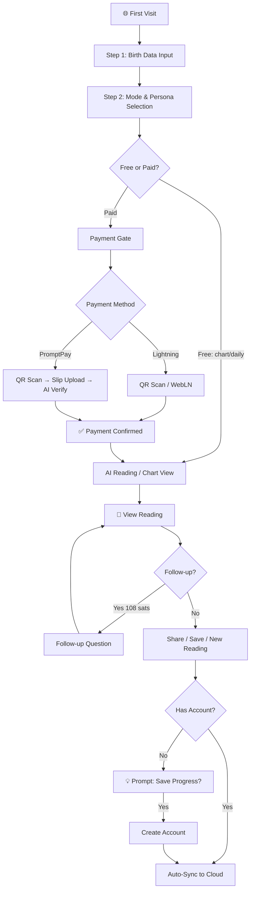
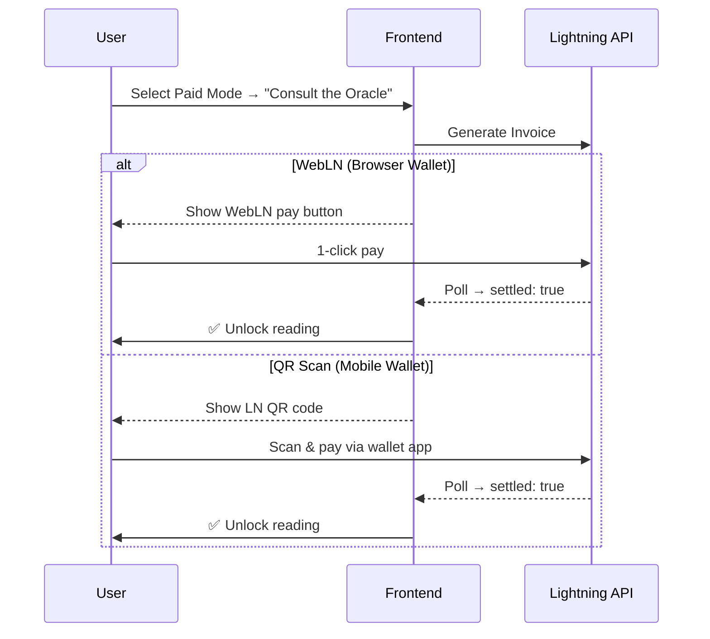
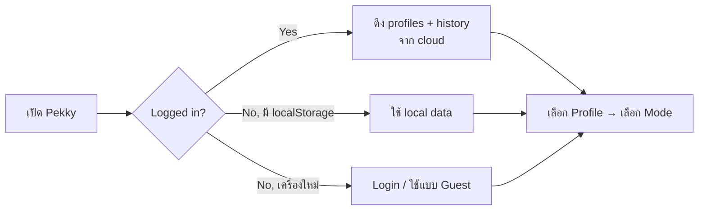

# Pekky: User Journey Manual v2.0

> **Purpose:** ออกแบบ user journey ตั้งแต่ First Visit → Account Creation → Reading → Payment → Re-engagement ที่ลื่นไหลทั้ง Desktop และ Mobile

---

## 1. Journey Overview (Mermaid)



---

## 2. Step-by-Step Journey

### 2.1 First Visit (Zero-friction Entry)

| Screen | User Action | System Response |
|--------|------------|-----------------|
| Landing | User sees Pekky mascot + tagline | Show "Start Reading" CTA |
| | No sign-up required | UID generated in `localStorage` |

> [!TIP]
> **Zero-friction principle:** ห้ามบังคับสร้างบัญชีก่อนใช้งาน ให้ user ลองอ่านดวงฟรีก่อน แล้วค่อย prompt ให้สร้างบัญชีหลังจาก "ได้รับ value" แล้ว

### 2.2 Birth Data Input (Step 1)

**Desktop & Mobile ต้องเหมือนกัน:**
- ชื่อ (First Name)
- วันเกิด (Date Picker → native on mobile)
- เวลาเกิด (Time Picker → native on mobile)
- สถานที่เกิด (Autocomplete via Nominatim)
- **Saved Profiles dropdown** (ถ้ามี)

### 2.3 Mode & Persona Selection (Step 2)

**Updated Product Menu (v2.0):**

| Mode | Price | Label (UX Copy) |
|------|-------|-----------------|
| `chart` | Free | 📊 Chart Only — ดูข้อมูลดิบ |
| `daily` | Free | 🌅 ดวงรายวัน — สั้น กระชับ |
| `detailed` | ฿10.80 | 🔮 วิเคราะห์ภาพรวมชีวิต |
| `focus_finance` | ฿36 | 🏦 เจาะลึก: การเงิน |
| `focus_career` | ฿36 | 💼 เจาะลึก: การงาน |
| `focus_relationship` | ฿36 | 💕 เจาะลึก: ความสัมพันธ์ |
| `bitcoin_synastry` | ฿54 | ₿ เทียบดวงกับบิตคอยน์ |
| `blueprint` | ฿108 | 🗺️ แผนผัง 12 เดือน |

**Follow-up ทุกโหมด (ยกเว้น chart):** ฿3.60 / 108 sats ต่อคำถาม

### 2.4 Payment Flow



> [!NOTE]
> **Phase 2:** PromptPay (Thai Baht) จะถูกเพิ่มภายหลังโดยใช้ payment gateway (เช่น Omise/GB Prime) แทนการอัปโหลดสลิป เพื่อลด friction ให้เหลือ "สแกน → จ่าย → ได้เลย" เหมือน Lightning

### 2.5 Reading Experience

| Element | Description |
|---------|-------------|
| **Stats Grid** | Astro Day, Age, Current Ruler, Next Ruler |
| **Natal Chart** | SVG visualization with house cusps |
| **AI Reading** | Formatted markdown with headers and bold |
| **Follow-up Box** | "ถามเภกกี้เพิ่ม — ฿3.60 ต่อคำถาม" (max 5) |
| **Action Bar** | Share · Save PDF · New Reading |

### 2.6 Post-Reading: Account Prompt (The Golden Moment)

> [!IMPORTANT]
> **Timing is everything.** Prompt สร้างบัญชี **หลังจาก user ได้รับ reading แล้ว** (ไม่ใช่ก่อน) เพราะ:
> 1. User เห็น value แล้ว → motivation สูง
> 2. User อยากเก็บ reading ที่จ่ายเงินไปแล้ว → pain of loss
> 3. User อยากเปิดดูจากมือถือ/คอมอื่น → practical need

**UX Copy (Thai):**
```
🔒 อยากเก็บดวงไว้เปิดดูจากทุกเครื่อง?
สร้างบัญชี Pekky ได้ฟรี — ไม่ต้องใช้ password!

[สร้างบัญชีด้วย Email]  [สร้างด้วย LINE]  [ข้ามไปก่อน]
```

### 2.7 Account System (Passwordless)

**Supported Auth Methods:**

| Method | Primary For | How It Works |
|--------|------------|--------------|
| **Magic Link (Email)** | Desktop users | ส่ง link ไป email → click = logged in |
| **LINE Login** | Thai mobile users | OAuth → 95% ของคนไทยมี LINE |
| **LNURL-auth** | Bitcoiners (Phase 2) | Sign with Lightning wallet key |

> [!TIP]
> **No passwords ever.** ระบบ auth ทั้งหมดเป็น passwordless — ไม่มี password hash ให้รั่วไหล ไม่มีอะไรให้ถูก brute force

### 2.8 Returning User Journey



---

## 3. Monetization Model v2.0

### 3.1 Updated Pricing Table (Marketing Feedback)

| Mode | Sats | THB | USD | Cultural Anchor |
|------|------|-----|-----|-----------------|
| Chart | 0 | Free | Free | ฟรี ≠ ไม่มีค่า |
| Daily | 0 | Free | Free | "ลองก่อนจ่าย" |
| Detailed | 318 | ฿10.80 | ~$0.30 | < ค่ากาแฟ |
| Focus (×3) | 1,080 | ฿36 | ~$1.00 | = ค่ากาแฟ |
| BTC Synastry | 1,620 | ฿54 | ~$1.50 | 54 = 108/2 |
| Blueprint | 3,176 | ฿108 | ~$3.00 | 108 มงคล |
| Follow-up | 108 | ฿3.60 | ~$0.10 | Micro-payment |

### 3.2 Revenue Multiplier: Follow-up System

เปลี่ยนจาก "Conversation Mode" (ถูกแต่ไม่ control cost) → **Follow-up per question**:

```
Revenue per session = Base Price + (N × 108 sats)
```

ตัวอย่าง Detailed reading + 3 follow-ups:
- เดิม: 318 sats (จบ)
- ใหม่: 318 + (3 × 108) = **642 sats** (+102% revenue)

### 3.3 Marketing Hooks per Tier

| Tier | Hook (TH) | Target Audience |
|------|-----------|-----------------|
| Chart | "ดูดวงฟรี ไม่ต้องสมัคร" | SEO / organic traffic |
| Daily | "Pekky ทักทายคุณทุกเช้า" | Habit formation |
| Focus | "เจาะลึกเรื่องเงิน/รัก/งาน" | Pain-point seekers |
| BTC Synastry | "เกิดมาเพื่อ Bitcoin?" | Crypto community viral |
| Blueprint | "แผนที่ชีวิต 12 เดือน" | High-intent buyers |

---

## 4. Retention Loops v2.0

### Loop 1: Daily Habit (Free → Paid Funnel)
```
ดวงฟรีทุกวัน → "วันนี้ดาวจรกระทบภพการเงิน" → User curious → ซื้อ Focus Finance (฿36)
```

### Loop 2: Follow-up Stacking
```
ซื้อ Detailed (฿10.80) → อ่านจบ → "แล้วเรื่องตำแหน่งใหม่ล่ะ?" → ฿3.60 → ฿3.60 → ฿3.60
```

### Loop 3: Bitcoin Synastry Viral
```
ซื้อ BTC Synastry → Share "ผมเข้ากับ Bitcoin 87%!" → เพื่อน click → New user
```

### Loop 4: Account Sync (Cross-device)
```
อ่านดวงจากมือถือบน BTS → กลับบ้านเปิด Desktop → เห็น reading เดิม + ถาม follow-up
```
